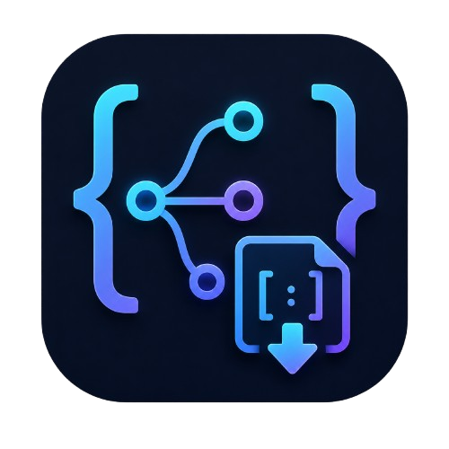

<p align="center">
  
</p>

<h1 align="center">OpenRouter JSON Prompt Loader</h1>

<p align="center">
  Aplicativo web para transformar tarefas em especificações técnicas e prompts estruturados com modelos gratuitos do OpenRouter.
</p>

<p align="center">
  
  
  
  
  
</p>

## Sobre o projeto

O OpenRouter JSON Prompt Loader ajuda a converter uma descrição de tarefa em uma especificação técnica organizada e em um prompt final pronto para usar no Codex ou em outra ferramenta de IA. Ele é voltado para quem quer dar mais contexto e consistência a pedidos de desenvolvimento.

O aplicativo consulta os modelos de texto gratuitos compatíveis com respostas JSON estruturadas no OpenRouter. Após escolher um modelo e informar a tarefa, a pessoa usuária pode anexar arquivos de referência e gerar o resultado nos formatos `.txt` e `.json`.

A chave da API é informada diretamente no navegador. Ela pode permanecer apenas na sessão ou, com consentimento explícito, ser salva no armazenamento local daquele navegador. Os arquivos de referência são lidos localmente e não há backend próprio neste projeto.

## Funcionalidades

- Informar e armazenar opcionalmente a chave da API do OpenRouter.
- Carregar modelos gratuitos compatíveis com JSON estruturado.
- Selecionar um modelo para a geração do prompt.
- Anexar até seis arquivos de texto, Markdown, JSON, CSV ou YAML.
- Validar o tamanho dos arquivos e o volume total de referências.
- Gerar uma especificação técnica em JSON.
- Montar um prompt final em texto para ferramentas de IA.
- Copiar o resultado em JSON para a área de transferência.
- Alternar entre temas visuais.

## Fluxo principal

1. Informar a chave da API do OpenRouter e decidir se ela pode ser salva neste navegador.
2. Escolher um modelo gratuito compatível com JSON estruturado.
3. Descrever a tarefa e, se necessário, anexar arquivos de referência.
4. Enviar a solicitação para gerar a especificação técnica.
5. Consultar o prompt final em texto ou o resultado estruturado em JSON.
6. Copiar o JSON quando for necessário reutilizá-lo em outra ferramenta.

## Tecnologias utilizadas

| Tecnologia | Utilização no projeto |
| --- | --- |
| **React 19** | Interface e gerenciamento dos componentes da aplicação. |
| **TypeScript 6** | Tipagem estática do código-fonte. |
| **Vite 8** | Servidor de desenvolvimento e build de produção. |
| **Tailwind CSS 4** | Classes utilitárias para o estilo do aplicativo. |
| **Safira UI 3** | Componentes acessíveis, tokens visuais e CSS base. |
| **TanStack Query** | Consulta e cache da lista de modelos do OpenRouter. |
| **React Hook Form e Zod** | Formulário e validação dos dados da tarefa. |
| **OpenRouter API** | Listagem de modelos e geração da especificação estruturada. |

## Estrutura do projeto

```text
openrouter-json-prompt-loader/
├── public/                 # Logo e favicon da aplicação
├── src/
│   ├── components/         # Componentes reutilizáveis da interface
│   ├── constants/          # Textos, chaves e opções fixas
│   ├── hook/               # Hooks para tema, modelos e geração
│   ├── pages/              # Páginas da aplicação
│   ├── schemas/            # Esquemas de validação e resposta
│   ├── types/              # Tipos de componentes e hooks
│   ├── utils/              # Persistência local de chave e modelo
│   ├── app.tsx             # Estrutura principal da interface
│   ├── index.css           # Tokens e estilos globais
│   └── main.tsx            # Ponto de entrada React
├── AGENTS.md               # Regras locais para Safira UI e Vite
├── vite.config.ts          # Configuração do Vite e React Compiler
└── package.json            # Dependências, metadados e scripts
```

- `/`: tela única para configurar e gerar prompts.

## Executando localmente

### Pré-requisitos

- Node.js 20.19 ou superior.
- npm.
- Uma chave da API do OpenRouter.

### Instalação

```bash
git clone https://github.com/AllanKevinScain/openrouter-json-prompt-loader.git
cd openrouter-json-prompt-loader
npm install
```

Inicie o ambiente de desenvolvimento:

```bash
npm run dev
```

Por padrão, a aplicação fica disponível em `http://localhost:3001`.

## Scripts disponíveis

| Comando | Finalidade |
| --- | --- |
| `npm run dev` | Inicia o servidor de desenvolvimento na porta 3001. |
| `npm run build` | Valida o TypeScript e cria o build de produção. |
| `npm run preview` | Inicia uma prévia local do build de produção. |
| `npm run lint` | Analisa o código com ESLint. |
| `npm run format` | Formata os arquivos TypeScript com Prettier. |

## Convenções do código

- Componentes, hooks e arquivos usam nomes em `kebab-case`.
- Componentes React usam PascalCase e funções internas usam camelCase.
- Tipos são organizados em `src/types` e esquemas de validação em `src/schemas`.
- O CSS da Safira UI é importado antes do CSS do aplicativo.
- Componentes Safira recebem `className` como objeto por parte, e não como string.
- Chaves do OpenRouter não devem aparecer em logs, mensagens de erro ou arquivos versionados.

## Licença

Este repositório ainda não declara uma licença de distribuição. Caso o projeto passe a ser compartilhado ou distribuído publicamente, adicione um arquivo de licença compatível com o uso pretendido.
